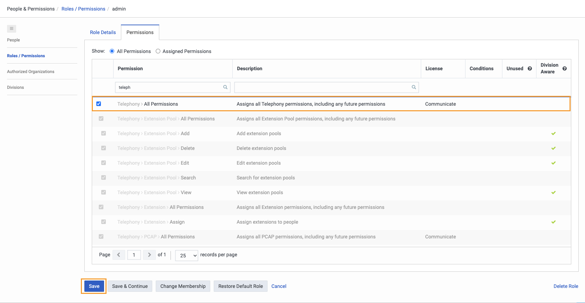
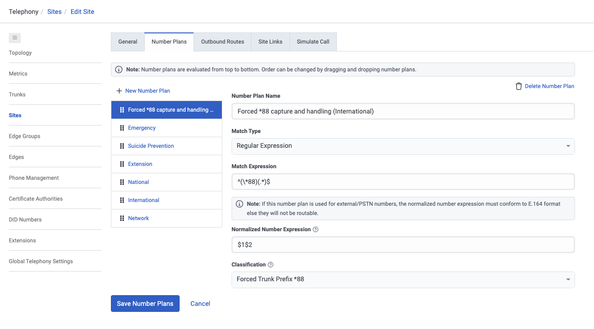
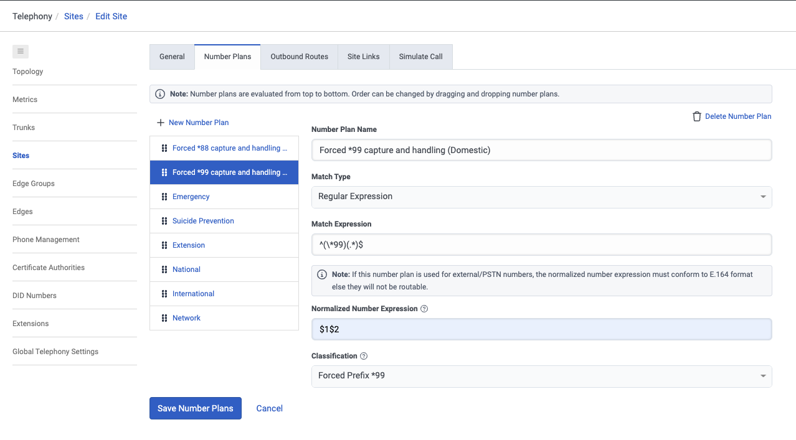
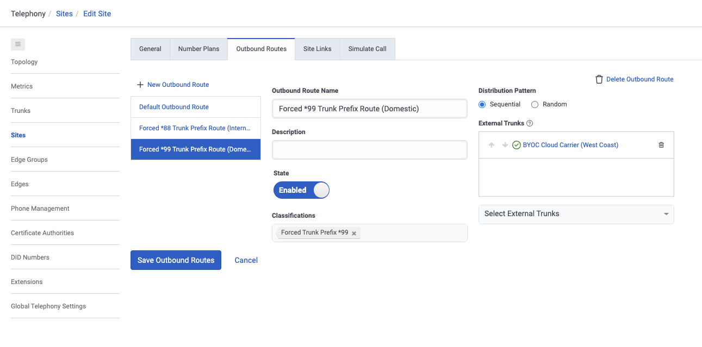
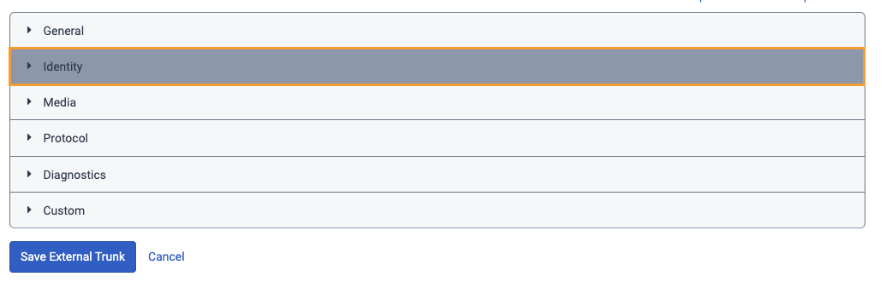
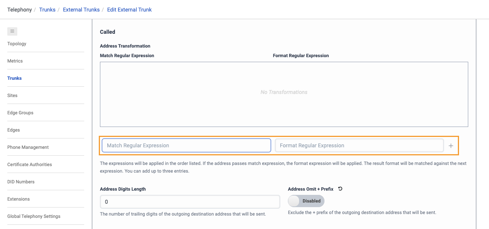
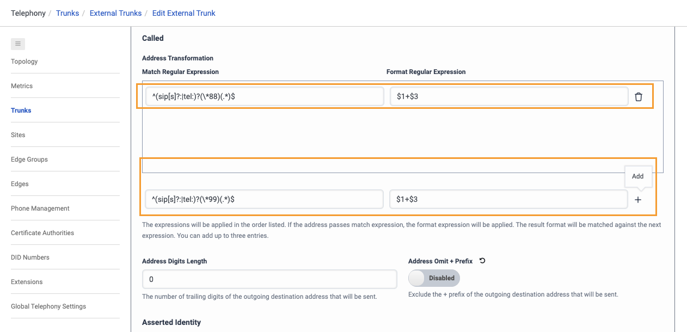

Genesys Cloud Trunk Selection Prefix
---
This Genesys Cloud Developer Blueprint explains how Genesys Cloud trunk selection is handled by configuration on Sites. Number Plans and Outbound Routes ultimately determine the target trunk by matching the dialed number against a prioritized Number Plan, classifying it, and attempting the highest priority trunk matching the classification. This is a blueprint is a solution for idea INB-I-1146 (https://genesyscloud.ideas.aha.io/ideas/INB-I-1146).

Telephony Administrators can steer different types of calls through different trunks, assuming there is something unique to the dialed number scheme that can be matched against using one of the supported match types. Match types include Digit Length, E.164 Number List, Inter-Country, Intra-Country, Number List, or RegEx.

## Solution components

* **Genesys Cloud** - A suite of Genesys cloud services for enterprise-grade communications, collaboration, and contact center management. Contact center agents use the Genesys Cloud user interface.
* **Genesys Cloud API** - A set of RESTful APIs that enables you to extend and customize your Genesys Cloud environment.
* **Trunks** - A telecommunications circuit from a carrier to a Genesys Cloud telephony connection. 
* **Sites** - the home of a set of phones. The site defines the call classification rules and outbound routing rules as well as the telephony properties for dialing.

## Prerequisites

### Specialized knowledge

* Administrator-level knowledge of Genesys Cloud
* Telephony Configurations
* Have an established set Trunk to configure Sites

### Genesys Cloud account

* A Genesys Cloud CX 1 license. For more information, see [Genesys Cloud Pricing](https://www.genesys.com/pricing "Opens the Genesys Cloud pricing article").
* The Master Admin role in Genesys Cloud. For more information, see [Roles and permissions overview](https://help.mypurecloud.com/?p=24360 "Opens the Roles and permissions overview article") in the Genesys Cloud Resource Center.

## Configure Genesys Cloud

### Assign permissions to access Telephony Configurations

1. Navigate to **Admin** > **Roles/Permissions**.
2. Ensure you have **Telephony**>**All Permissions** permission.
3. Click **Save** to assign the appropriate permissions to your role.

   

## Sites 

### 1. Create a Site

Trunks are put on routes within sites.

1. Go to **Admin**>**Telephony**>**Sites**
2. Create a site. For example purposes, I will create a site called “Trunk Selection Prefix”. 
2. You can create special Number Plans.
3. Save Number Plan
4. You can specify Outbound Routes
5. Save Outbound Routes

### 2. Create a Number Plan
1. Click "New Number Plan" to create a new Number Plan
2. Input Number Plan Name
3. Input Match Type
4. Input Match Exptression
5. Input Normalized Number Expression
6. Input Classification 

#### Here are two examples:

**Example 1**: Forced *88 capture and handling (International)
1. Created a new Number Plan called "Forced *88 capture and handling (International)" 
2. Match Type set to "Regular Expression"
3. Match Exptression set to "^(\*88)(.*)$"
5. Normalized Number Expression set to "$1$2"
6. Classification customized to "Forced Trunk Prefix *88". NOTE: You can input custom text and press ENTER if you want to custom classify. 
7. Save Number Plan

**Example 2**: Forced *99 capture and handling (Domestic)
1. Created a new Number Plan called "Forced *99 capture and handling (Domestic)" 
2. Match Type set to "Regular Expression"
3. Match Exptression set to "^(\*99)(.*)$"
5. Normalized Number Expression set to "$1$2"
6. Classification customized to "Forced Trunk Prefix *99". NOTE: You can input custom text and press ENTER if you want to custom classify. 
7. Save Number Plan

### 3. Create Outbound Routes
1. Click "New Outbound Route" to create a new Outbound Route
2. Input Outbound Route Name
3. Input Description (optional)
4. Toggle State (Enabled/Disabled)
5. Input Classification Tag
6. Select Distribution Pattern: Sequentional or Random
7. Select External Trunks 
8. Save Outbound Route

#### Here are two examples:

**Example 1**: Forced *88 Trunk Prefix Route (International)
1. Created a new Number Plan called "Forced *88 Trunk Prefix Route (International)" 
2. Description - left it blank
3. State: Enabled
5. Classification tag set to "Forced Trunk Prefix *88" 
6. Distribution Pattern: Sequential 
7. External Trunk: "BYOC Cloud Carrier (West Coast) 
8. Save Outbound Routes

**Example 2**: Forced *99 Trunk Prefix Route (International)
1. Created a new Number Plan called "Forced *88 Trunk Prefix Route (International)" 
2. Description - left it blank
3. State: Enabled
5. Classification tag set to "Forced Trunk Prefix *99" 
6. Distribution Pattern: Sequential 
7. External Trunk: "BYOC Cloud Carrier (West Coast) 
8. Save Outbound Routes

### 3. Edit External Trunk

If you want to add additional customization to the External Trunk, you can do the following:

1. Click on the External Trunk Link
   
2. Click "Identity" dropdown
   
3. Under the Called Section, you can input "Match Regular Expression" and "Format Regular Expression".
4. Click "+" to add the Regex 
   
5. Save External Trunk

**Example**: Adding the following two Regular Expressions to the External Trunk

### You can now add numbers to the Blacklist Data Table under the ani column header and those callers will be disconnected when they try calling you.  

## Additional resources

* [Genesys Cloud API Explorer](https://developer.genesys.cloud/devapps/api-explorer "Opens the GC API Explorer") in the Genesys Cloud Developer Center
* [Genesys Cloud notification triggers](https://developer.genesys.cloud/notificationsalerts/notifications/available-topics "Opens the Available topics page") in the Genesys Cloud Developer Center
* The [ani-blacklist](https://github.com/GenesysCloudBlueprints/ani-blacklist) repository in GitHub
